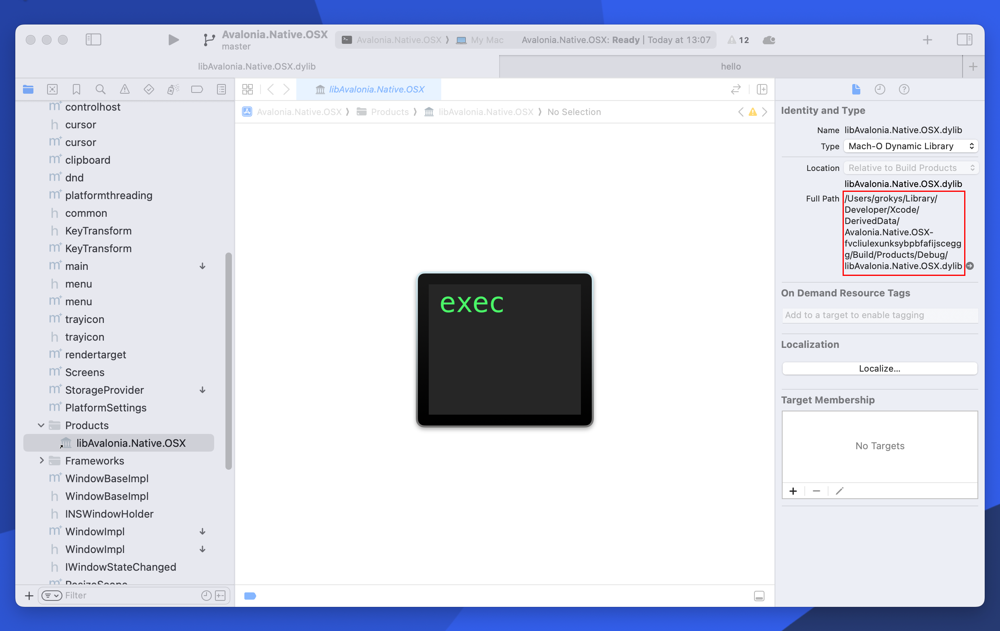

# macOS Native Code

The macOS platform backend has a native component, written in objective-c and located in [`native/Avalonia.Native/src/OSX`](../native/Avalonia.Native/src/OSX/). To work on this code, open the [`Avalonia.Native.OSX.xcodeproj`](../native/Avalonia.Native/src/OSX/Avalonia.Native.OSX.xcodeproj)project in Xcode.

Changes to the native portion of the code can be recompiled in two ways:

1. Using the [`build.sh`](build.md#build-native-libraries-macos-only) script: this has the downside that it will trigger a full recompile of Avalonia
2. Using `AvaloniaNativeLibraryPath` described below

## Using `AvaloniaNativeLibraryPath `

When you make changes in Xcode and recompile using Cmd+B, the binary will be compiled to a location that can be seen under "Products":



To use this build in Avalonia, one can specifiy the path by using `AvaloniaNativePlatformOptions.AvaloniaNativeLibraryPath` in an application's AppBuilder:

```csharp
public static AppBuilder BuildAvaloniaApp() =>
    AppBuilder.Configure<App>()
        .UsePlatformDetect()
        .With(new AvaloniaNativePlatformOptions
    { 
        AvaloniaNativeLibraryPath = "[Path to your dylib]", 
    })
```

# Bundling Development Code

In certain situations you need to run an Avalonia sample application as an app bundle. One of these situations is testing macOS Accessibility - Xcode's Accessibility Inspector fails to recognise the application otherwise. To facilitate this, the [`IntegrationTestApp`](../samples/IntegrationTestApp/) has a [`bundle.sh`](../samples/IntegrationTestApp/bundle.sh) script which can be run to create a bundle of that application.

Alteratively, if you need to bundle another project, another solution is to change the sample's output path to resemble an app bundle. You can do this by modifying the output path in the csproj, e.g.:

```xml
<OutputPath>bin\$(Configuration)\$(Platform)\ControlCatalog.NetCore.app/Contents/MacOS</OutputPath>
<AppendTargetFrameworkToOutputPath>false</AppendTargetFrameworkToOutputPath>
<UseAppHost>true</UseAppHost>
```

And in the Contents output directory place a valid `Info.plist` file. An example for ControlCatalog.NetCore is:

```xml
<?xml version="1.0" encoding="utf-8"?>
<!DOCTYPE plist PUBLIC "-//Apple//DTD PLIST 1.0//EN" "http://www.apple.com/DTDs/PropertyList-1.0.dtd">
<plist version="1.0">
  <dict>
    <key>CFBundleName</key>
    <string>ControlCatalog.NetCore</string>
    <key>CFBundleDisplayName</key>
    <string>ControlCatalog.NetCore</string>
    <key>CFBundleIdentifier</key>
    <string>ControlCatalog.NetCore</string>
    <key>CFBundleVersion</key>
    <string>0.10.999</string>
    <key>CFBundlePackageType</key>
    <string>AAPL</string>
    <key>CFBundleSignature</key>
    <string>????</string>
    <key>CFBundleExecutable</key>
    <string>ControlCatalog.NetCore</string>
    <key>CFBundleIconFile</key>
    <string>ControlCatalog.NetCore.icns</string>
    <key>CFBundleShortVersionString</key>
    <string>0.1</string>
    <key>NSPrincipalClass</key>
    <string>NSApplication</string>
    <key>NSHighResolutionCapable</key>
    <true />
  </dict>
</plist>
```
