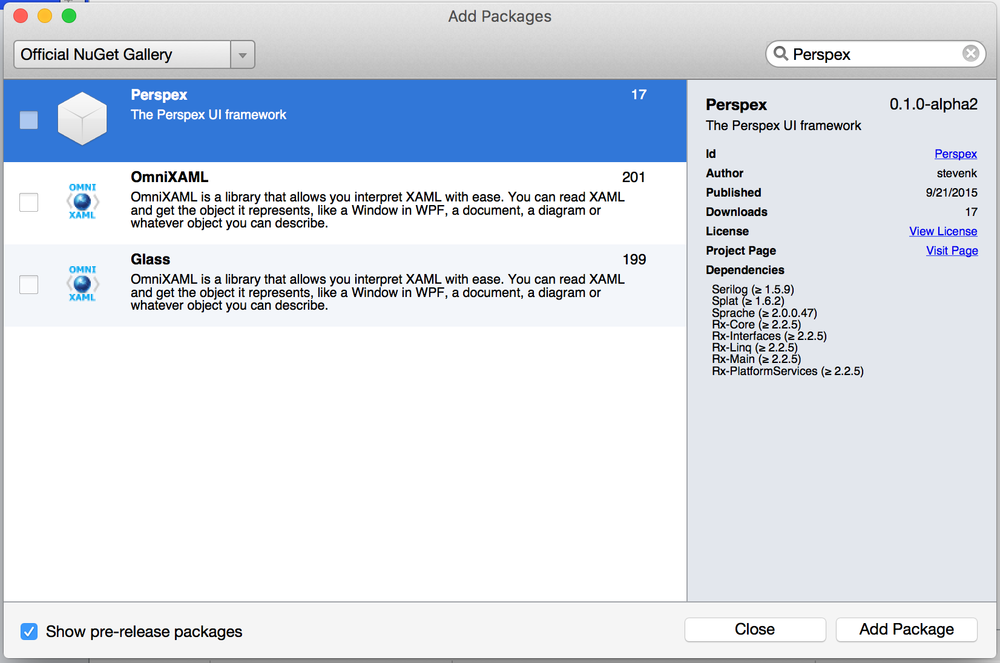

# Getting Started

## Windows

The easiest way to try out Perspex is to install the Visual Studio Extension.

This will add a Perspex project template and a Window template to the standard Visual Studo “Add” dialog (yes, icons still to come :) ):

## OSX / Linux

It is a little more manual on non-Windows platforms, but using Xamarin Studio you can install the Perspex NuGet package.

