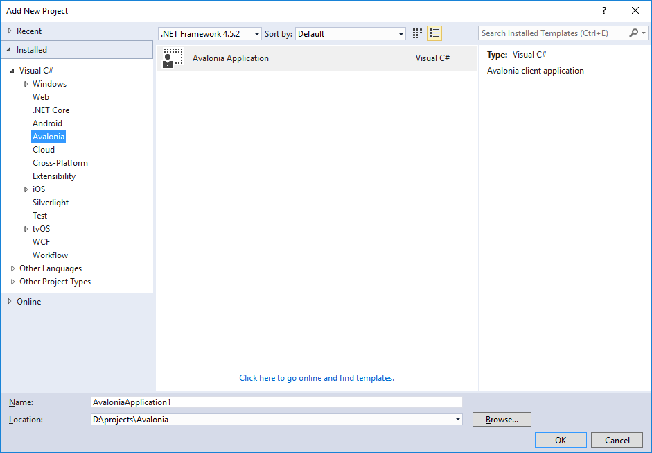
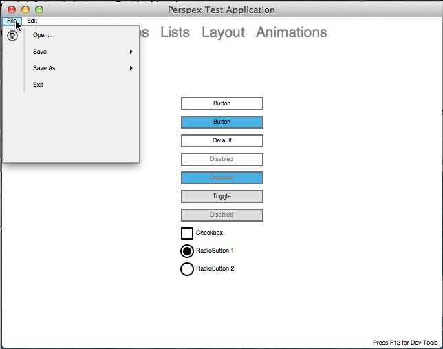
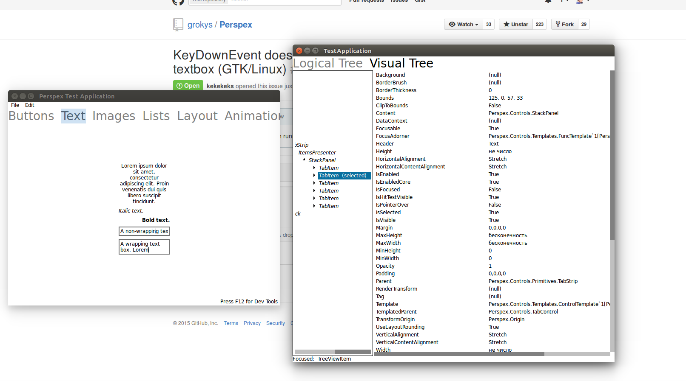

# The Avalonia UI Framework

Cross platform .NET UI Framework with bindings and XAML

## Current status

We're pleased to announce that Avalonia is now in alpha!

What does alpha mean? Well, it means that it's now at a stage where you can have a play and hopefully create simple applications. There's now a Visual Studio Extension containing project and item templates that will help you get started, and there's an initial complement of controls. There's still a lot missing, and you will find bugs, and the API will change, but this represents the first time where we've made it somewhat easy to have a play and experiment with the framework.

## How do I try it out

The easiest way to try out Avalonia is to install the [Visual Studio Extension](https://marketplace.visualstudio.com/items?itemName=AvaloniaTeam.AvaloniaforVisualStudio).

This will add a Avalonia project template and a Window template to the standard Visual Studo "Add" dialog (yes, icons still to come :) ):

Creating a Avalonia Project will give you a simple project with a single XAML window. We even have a simple designer:

You can also find the project [on GitHub](https://github.com/AvaloniaUI/Avalonia/)

## News

You can read news about Avalonia on [Groky's blog](http://grokys.github.io/)

## Cross Platform

Fow now we can run on Windows, Linux and Mac.

## Inspection support

