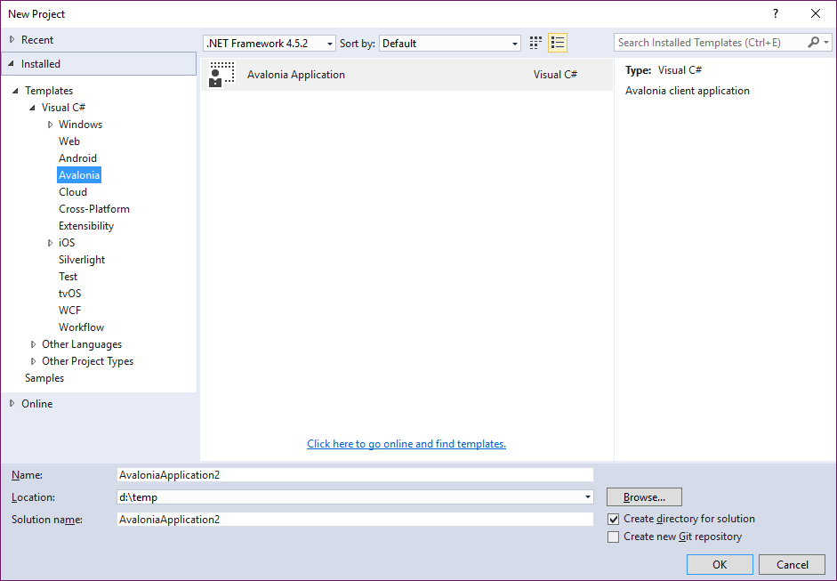

# Getting Started

## Windows

The easiest way to try out Avalonia is to install the [Visual Studio Extension](https://marketplace.visualstudio.com/items?itemName=AvaloniaTeam.AvaloniaforVisualStudio).

This will add a Avalonia project template and a Window template to the standard Visual Studo “Add”
dialog (yes, icons still to come :) ):
