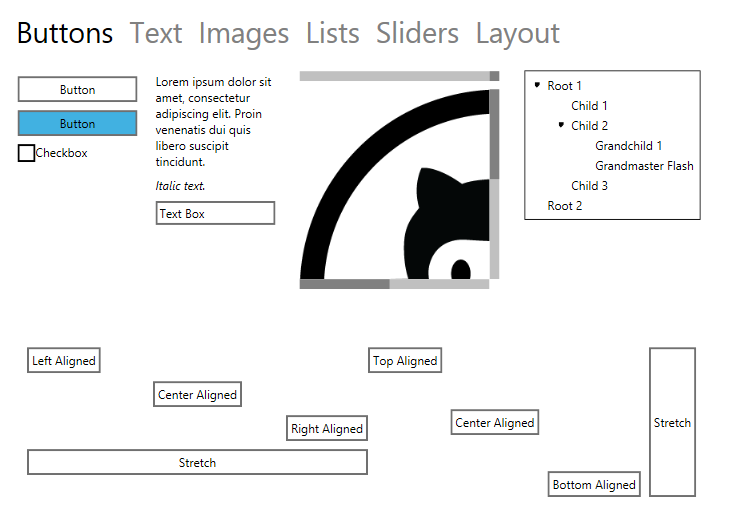

# Perspex #

...a next generation WPF?

## Background ##

As everyone who's involved in client-side .NET development knows, the past half decade have been a
very sad time. Where WPF started off as a game-changer, it now seems to have been all but forgotten.
WinRT came along and took many of the lessons of WPF but it's currently not usable on the desktop.

After a few months of trying to reverse-engineer WPF with the [Avalonia Project](https://github.com/grokys/Avalonia) I began to come to the same conclusion that I imagine Microsoft
came to internally: for all its groundbreaking-ness at the time, WPF at its core is a dated mess,
written for .NET 1 and barely updated to even bring it up-to-date with .NET 2 features such as
generics.

So I began to think: what if we were to start anew with modern C# features such as *(gasp)*
Generics, Observables, async, etc etc. The result of that thought is Perspex.

##### DISCLAIMER
This is really early development pre-alpha-alpha stuff. Everything is subject to
change, I'm not even sure if the performance characteristics of Rx make Observables suitable for
binding throughout a framework. *I'm writing this only to see if the idea of exploring these ideas
appeals to anyone else.*

## Documentation
As mentioned above this is really an early version of Perspex and we're working hard on improving the code base and the documentation at the same time. Please feel free to have a look at our [introduction document](Docs/intro.md) to get things started real quick.

There's also a high-level [architecture document](Docs/architecture.md).

I've also started writing blog posts on Perspex at http://grokys.github.io/.

Contributions are always welcome!

## Building and Using
In order to build and use Perpex you need a compiler that supports C# 6 such as Visual Studio 2015.

## Contributing ##

Please read the [contribution guidelines](Docs/contributing.md) before submitting a pull request.
