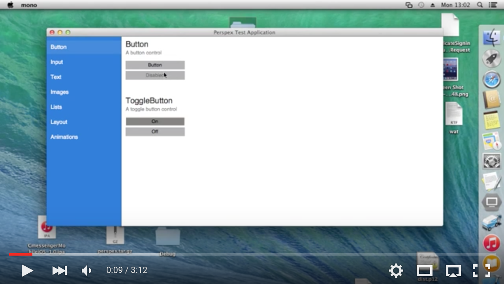

# Perspex

A multi-platform .NET UI framework.

<a href='https://www.youtube.com/watch?t=28&v=c_AB_XSILp0' target='_blank'><a/>

## NuGet

Perspex is delivered as a NuGet package.
You can find the packages here: ([stable(ish)](https://www.nuget.org/packages/Perspex/), [nightly](https://github.com/Perspex/Perspex/wiki/Using-nightly-build-feed))

You can install the package like this:
`Install-Package Perspex -Pre`

## Background

Perspex is a multi-platform windowing toolkit - somewhat like WPF - that is intended to be multi-
platform. It supports XAML, lookless controls and a flexible styling system, and runs on Windows
using Direct2D and other operating systems using Gtk & Cairo.

## Current Status

Perspex is now in alpha. What does "alpha" mean? Well, it means that it's now at a stage where you
can have a play and hopefully create simple applications. There's now a [Visual
Studio Extension](https://visualstudiogallery.msdn.microsoft.com/a4542e8a-b56c-4295-8df1-7e220178b873)
containing project and item templates that will help you get started, and
there's an initial complement of controls. There's still a lot missing, and you
*will* find bugs, and the API *will* change, but this represents the first time
where we've made it somewhat easy to have a play and experiment with the
framework.

## Documentation

As mentioned above, Perspex is still in alpha and as such there's not much documentation yet. You can
take a look at the [getting started page](docs/gettingstarted.md) for an
overview of how to get started but probably the best thing to do for now is to already know a little bit
about WPF/Silverlight/UWP/XAML and ask questions in our [Gitter room](https://gitter.im/Perspex/Perspex).

There's also a high-level [architecture document](docs/architecture.md) that is currently a little bit
out of date, and I've also started writing blog posts on Perspex at http://grokys.github.io/.

Contributions are always welcome!

## Building and Using

See the [build instructions here](https://github.com/grokys/Perspex/blob/master/docs/build.md)

## Contributing ##

Please read the [contribution guidelines](docs/contributing.md) before submitting a pull request.
